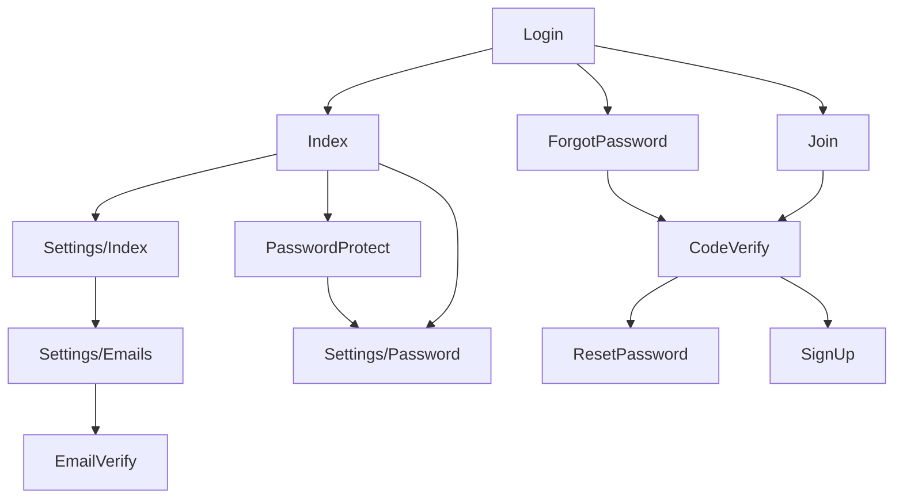

# bear-app


## Overview

bear-app は BEAR.Sunday フレームワークをベースにした、Web アプリケーションです。  
DDD（Domain-Driven Design）と CQRS（Command Query Responsibility Segregation）アーキテクチャを採用し、  
堅牢で保守性の高い設計を実現しています。

### 主な特徴

* **DDD + CQRS アーキテクチャ**: 190個以上の PHP ファイルによる本格的な DDD 実装
* **高度なセキュリティ**: Cloudflare Turnstile、レート制限、パスワード保護、アカウントロック
* **完全な認証・認可システム**: リソース単位の権限管理、パスワード再確認機能
* **メール管理機能**: キュー、スケジュール送信、テンプレートエンジン連携
* **REST API 対応**: HAL+JSON フォーマットサポート
* **AOP による横断的関心事の分離**: アトリビュートベースのインターセプター

### 技術要件

* PHP 8.3 以上
* MySQL 8.0 以上（本番）/ SQLite 3（開発）
* Composer
* Node.js & npm（フロントエンドビルド用）

## Framework & Library

### Backend

* Framework / [BEAR.Sunday](https://github.com/bearsunday/BEAR.Sunday)
* Template Engine / [Qiq](https://github.com/qiqphp/qiq)
* Form / [Aura.Input](https://github.com/auraphp/Aura.Input), [Aura.Filter](https://github.com/auraphp/Aura.Filter)
* Session / [Aura.Session](https://github.com/auraphp/Aura.Session)
* Auth / [Aura.Auth](https://github.com/auraphp/Aura.Auth)
* Router / [Aura.Router](https://github.com/auraphp/Aura.Router)
* Media / [Ray.MediaQuery](https://github.com/ray-di/Ray.MediaQuery)
* AOP / [Ray.AOP](https://github.com/ray-di/Ray.Aop)
* DI / [Ray.Di](https://github.com/ray-di/Ray.Di)
* Env / [env-json](https://github.com/koriym/Koriym.EnvJson)
* Mail / [PHPMailer](https://github.com/PHPMailer/PHPMailer)

### Frontend

* CSS / [Tailwind CSS](https://tailwindcss.com/)
* JavaScript bundler / [Rollup](https://rollupjs.org)

## Form sample

* [Contact](http://localhost/admin/contact-demo)
* [Fieldset](http://localhost/admin/fieldset-demo)
* [Multiple](http://localhost/admin/multiple-demo)
* [Upload](http://localhost/admin/upload-demo)

## Demo

http://localhost/admin/login



## Features

### 認証・認可機能

#### 管理者認証
* **ログイン・ログアウト**: ID & パスワード認証
* **Remember me**: 自動ログイン機能（トークンベース）
* **パスワードリセット**: メール経由のパスワードリセット
* **アカウント作成**: 招待メール経由の新規アカウント作成
* **アカウント削除**: 論理削除による安全なアカウント削除
* **パスワード再確認**: 重要な操作前のパスワード再入力（5分間有効）

#### 権限管理
* **リソース単位の権限制御**: `#[RequiredPermission]` アトリビュート
* **3段階の権限レベル**:
  - `Privilege`: 全権限
  - `Read`: 読み取り権限
  - `Write`: 書き込み権限
* **Allow/Deny ルール**: 柔軟なアクセス制御

#### ユーザー認証
* 管理者と同様の認証基盤
* `#[UserGuard]` アトリビュートによる保護

### メール機能

* **メール送信キュー**: 即時送信・スケジュール送信対応
* **リトライ機能**: 送信失敗時の自動再試行
* **テンプレートエンジン連携**: HTML/テキスト形式のメールテンプレート
* **実装済みメールテンプレート**:
  - 管理者招待メール
  - パスワードリセットメール
  - メールアドレス確認メール
  - パスワード変更通知メール
  - アカウント削除通知メール
* **複数メールアドレス管理**: 管理者ごとに複数のメールアドレスを登録可能
* **メールアドレス検証**: 確認メールによる所有権確認

### セキュリティ機能

#### ボット対策

* **Cloudflare Turnstile**: ログイン・パスワードリセット時のボット対策

#### レート制限

* **Throttling**: IP + URI ベースのレート制限
* **`#[RateLimiter]` アトリビュート**: 柔軟なレート制限設定
* **429 Too Many Requests**: 制限超過時の適切なレスポンス

#### アカウント保護

* **ログイン試行制限**: 連続10回失敗でアカウントロック（30分間）
* **パスワード保護**: 重要操作前のパスワード再確認（5分間有効）
* **危険なパスワードのブラックリスト**: よく使われる脆弱なパスワードを禁止

#### 通知機能

* **パスワード変更通知**: パスワード変更時にメール通知
* **メールアドレス追加通知**: 新しいメールアドレス追加時に通知
* **メールアドレス確認**: 確認メールによる検証

### フラッシュメッセージ

* Aura.Session FlashMessenger による一時メッセージ表示
* 成功/エラー/警告メッセージの表示

### REST API

* **HAL+JSON 対応**: `Accept: application/json` ヘッダーで API レスポンス
* **リソース指向**: BEAR.Sunday の RESTful アーキテクチャ

### コマンドラインツール

* **危険なパスワードのインポート**:
  ```bash
  php ./bin/command.php post /import-bad-passwords
  ```
* **スケジュール済みメールの送信**:
  ```bash
  php ./bin/command.php post /send-email-from-email-queue
  ```
* **削除済み管理者の完全削除**:
  ```bash
  php ./bin/command.php post /delete-admins
  ```

## Architecture

### レイヤー構成

本プロジェクトは **DDD（Domain-Driven Design）** と **CQRS（Command Query Responsibility Segregation）** を採用しています。

#### 1. Domain 層（ドメイン層）

* **場所**: `source/app/ddd/core/src/Domain/`
* **責務**: ビジネスロジックの中核
* **構成要素**:
  - Entity / Value Object
  - Domain Service（22個のサブドメイン）
  - Repository Interface
  - Domain Exception

**実装済みドメイン**:
- AccessControl（権限管理）
- Admin（管理者）
- AdminPermission（管理者権限）
- AdminToken（トークン）
- Auth（認証）
- Captcha（キャプチャ）
- Encrypter（暗号化）
- FlashMessenger（フラッシュメッセージ）
- Hasher（ハッシュ）
- Language（多言語）
- Mail（メール）
- SecureRandom（安全な乱数）
- Session（セッション）
- Throttle（レート制限）
- UrlSignature（URL署名）
- User（ユーザー）
- VerificationCode（検証コード）

#### 2. Application 層（アプリケーション層）

* **場所**: `source/app/ddd/core/src/Application/`
* **責務**: ユースケースの実装
* **構成要素**:
  - Use Case（15個）
  - InputData / OutputData

**実装済みユースケース**:
- CreateAdminUseCase
- DeleteAdminUseCase
- UpdateAdminPasswordUseCase
- CreateAdminEmailUseCase
- VerifyAdminEmailUseCase
- ForgotAdminPasswordUseCase
- ResetAdminPasswordUseCase
- JoinAdminUserCase
- SendEmailFromEmailQueueUseCase
- など

#### 3. Infrastructure 層（インフラ層）

* **場所**: `source/app/ddd/core/src/Infrastructure/`
* **責務**: 技術的実装の詳細
* **構成要素**:
  - Entity（データベース Entity）
  - Persistence（Repository 実装）
  - Query / Command（CQRS の Query/Command）
  - Shared（共通実装）

#### 4. Presentation 層（プレゼンテーション層）

* **場所**: `source/app/src/`
* **責務**: ユーザーインターフェース
* **構成要素**:
  - Resource Object（BEAR.Sunday のリソース）
  - Form
  - Interceptor（AOP）
  - Template

### CQRS 実装

* **Query（読み取り）**: Ray.MediaQuery を使用した SQL ファイルベースのクエリ
  - 場所: `source/app/ddd/core/src/Infrastructure/Query/`
  - SQL: `source/app/var/sql/`
* **Command（書き込み）**: Repository パターンによるドメインモデル操作
  - 場所: `source/app/ddd/core/src/Infrastructure/Persistence/`

### AOP（Aspect-Oriented Programming）

Ray.Aop を使用したアトリビュートベースのインターセプター実装。

**実装済みインターセプター**（12個）:
- AdminAuthGuardian（認証チェック）
- AdminAuthentication（ログイン・ログアウト）
- AdminPasswordProtector（パスワード保護）
- AdminAuthorization（権限チェック）
- CloudflareTurnstileVerification（ボット対策）
- Throttling（レート制限）
- FormValidation（フォーム検証）
- TransactionalInterceptor（トランザクション管理）
- など

### DI（Dependency Injection）

Ray.Di を使用したコンストラクタインジェクション。

**設定場所**: `source/app/src/Module/`
- AppModule
- DevModule / ProdModule
- HtmlModule / HalModule

## Database

### サポート DBMS

* **本番環境**: MySQL 8.0 以上

### 主要テーブル

#### 管理者関連

| テーブル名               | 説明                 |
|---------------------|--------------------|
| `admins`            | 管理者アカウント           |
| `admin_emails`      | 管理者メールアドレス（複数登録可能） |
| `admin_permissions` | 管理者権限（リソース・権限レベル）  |
| `admin_tokens`      | Remember me トークン   |
| `admin_deletes`     | 削除済み管理者（論理削除）      |

#### ユーザー関連

| テーブル名   | 説明        |
|---------|-----------|
| `users` | ユーザーアカウント |

#### メール関連

| テーブル名                    | 説明       |
|--------------------------|----------|
| `email_queues`           | メール送信キュー |
| `email_queue_recipients` | メール受信者   |

#### セキュリティ関連

| テーブル名                | 説明                |
|----------------------|-------------------|
| `throttles`          | レート制限記録（IP + URI） |
| `verification_codes` | 検証コード（メール確認用）     |
| `bad_passwords`      | 危険なパスワードリスト       |

### スキーマ管理

* **スキーマファイル**: `source/app/var/schema/mysql/`
* **SQL ファイル**: `source/app/var/sql/`

## Directory Structure

```
source/app/
├── bin/                          # コマンドラインツール
│   ├── command.php              # コマンド実行
│   └── page.php                 # ページ実行
├── ddd/core/                     # DDD 実装（190個のファイル）
│   ├── src/
│   │   ├── Domain/              # ドメイン層（22サブドメイン）
│   │   ├── Application/         # アプリケーション層（15 UseCase）
│   │   └── Infrastructure/      # インフラ層
│   │       ├── Entity/          # DB Entity
│   │       ├── Persistence/     # Repository 実装
│   │       └── Query/           # CQRS Query/Command
│   └── tests/                   # テストコード
├── src/                          # プレゼンテーション層
│   ├── Annotation/              # アトリビュート定義（15個）
│   ├── Interceptor/             # AOP インターセプター（12個）
│   ├── Resource/                # BEAR.Sunday リソース
│   │   ├── Page/               # ページリソース（Admin/User）
│   │   ├── App/                # API リソース
│   │   └── Command/            # コマンドリソース
│   ├── Form/                    # フォーム定義
│   ├── InputQuery/              # 入力バリデーション
│   ├── Module/                  # DI モジュール設定
│   ├── Provider/                # プロバイダー（8個）
│   └── TemplateEngine/          # Qiq テンプレート設定
├── var/
│   ├── schema/                  # DB スキーマ（MySQL/SQLite）
│   ├── sql/                     # SQL 定義ファイル
│   ├── qiq/template/           # Qiq テンプレート
│   ├── email/                   # メールテンプレート
│   └── lang/ja/                # 日本語言語ファイル
└── public/                       # ドキュメントルート
    ├── index.php                # エントリーポイント
    └── admin-src/               # フロントエンドソース（Tailwind CSS）
```

## Setup

### 1. 依存パッケージのインストール

```bash
cd source/app
composer install
```

### 2. フロントエンドのビルド

```bash
cd source/app/public/admin-src
npm install
npm run build
npm run tailwindcss
```

### 3. データベースのセットアップ

#### MySQL の場合

```bash
# データベース作成
mysql -u root -p
CREATE DATABASE bear_app CHARACTER SET utf8mb4 COLLATE utf8mb4_unicode_ci;
GRANT ALL PRIVILEGES ON bear_app.* TO 'your_user'@'localhost';

# スキーマのインポート
mysql -u your_user -p bear_app < source/app/var/schema/mysql/schema.sql
```

### 4. 環境変数の設定

`.env.json` ファイルを作成し、データベース接続情報を設定します。

```json
{
  "DB_DSN": "mysql:host=localhost;dbname=bear_app",
  "DB_USER": "your_user",
  "DB_PASS": "your_password"
}
```

### 5. Web サーバーの起動

```bash
cd docker
./docker-startup.sh
```

### 6. 管理画面へアクセス

```
http://localhost/admin/login
```

## Development

### コーディング規約

* PSR-12 準拠
* PHPStan Level 8

### テスト実行

```bash
cd source/app
composer tests
```

### フロントエンド開発

```bash
cd source/app/public/admin-src
npm run build
npm run tailwindcss
```
