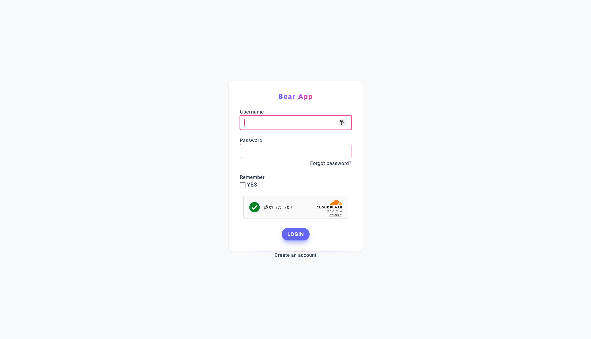

# bear-app

## Framework, Library

### Backend

* Framework / [BEAR.Sunday](https://github.com/bearsunday/BEAR.Sunday)
* Template Engine / [Qiq](https://github.com/qiqphp/qiq)
* Form / [Aura.Input](https://github.com/auraphp/Aura.Input), [Aura.Filter](https://github.com/auraphp/Aura.Filter)
* Session / [Aura.Session](https://github.com/auraphp/Aura.Session)
* Auth / [Aura.Auth](https://github.com/auraphp/Aura.Auth)
* Router / [Aura.Router](https://github.com/auraphp/Aura.Router)
* Media / [Ray.MediaQuery](https://github.com/ray-di/Ray.MediaQuery)
* AOP / [Ray.AOP](https://github.com/ray-di/Ray.Aop)
* DI / [Ray.Di](https://github.com/ray-di/Ray.Di)
* Env / [env-json](https://github.com/koriym/Koriym.EnvJson)

### Frontend

* CSS / [tailwindcss](https://tailwindcss.com/)
* JavaScript bundler / [Deno](https://deno.com/)

## Form sample

* [Contact](http://localhost/admin/contact-demo)
* [Fieldset](http://localhost/admin/fieldset-demo)
* [Multiple](http://localhost/admin/multiple-demo)
* [Upload](http://localhost/admin/upload-demo)

## Login

[Demo](http://localhost/admin/login)

### Features

* ID & password
* Remember me

### Security

* Google reCAPTCHA v2
* Account lock after consecutive failures
* Password confirm when important page visit
* Email notification after password change

* _Schedule: E-mail authentication_
* _Schedule: E-mail notification_
* _Schedule: Password reminder_
* _Schedule: Ban common passwords (priority:Low)_
